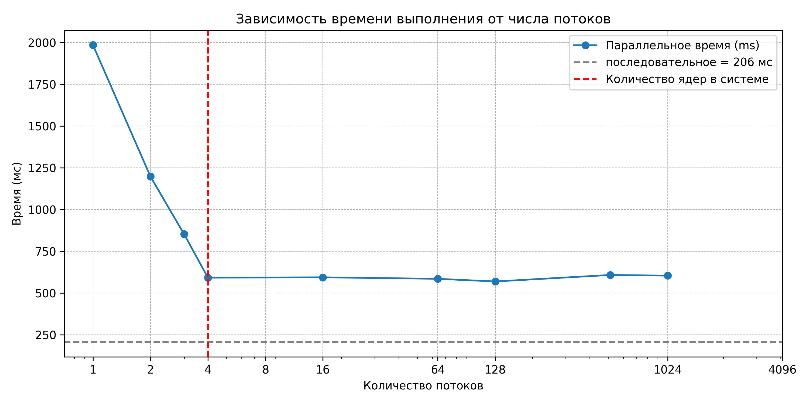
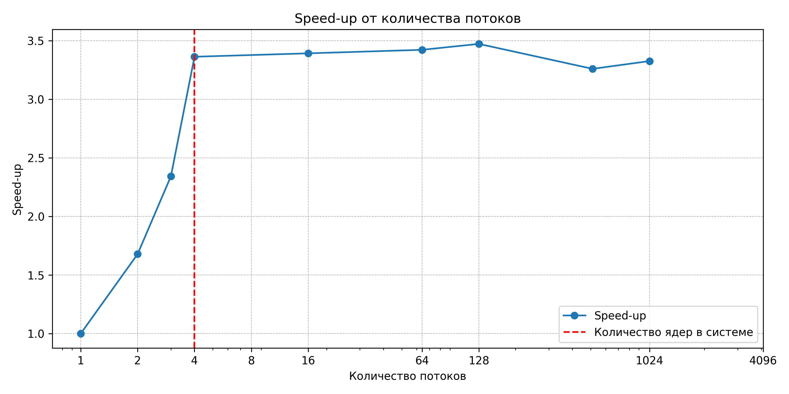
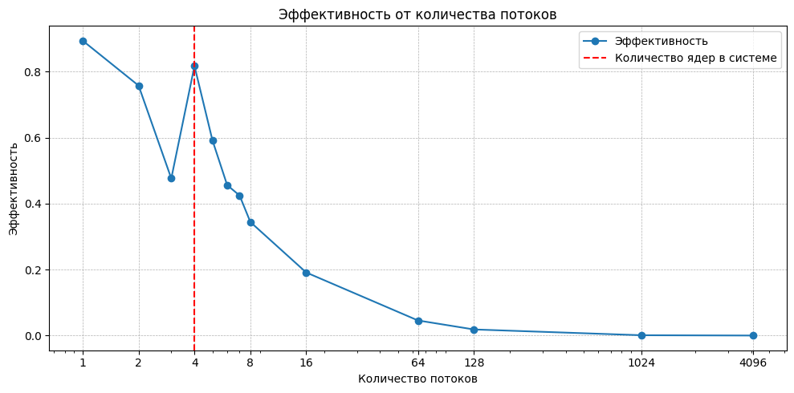

# os_lab_2
Цель работы
Целью является приобретение практических навыков в:
 Управление потоками в ОС
 Обеспечение синхронизации между потоками
Задание
Составить программу на языке Си, обрабатывающую данные в многопоточном режиме. При обработки использовать стандартные средства создания потоков операционной системы (Windows/Unix). Ограничение максимального количества потоков, работающих в один момент времени, должно быть задано ключом запуска вашей программы. Так же необходимо уметь продемонстрировать количество потоков, используемое вашей программой с помощью стандартных средств операционной системы. В отчете привести исследование зависимости ускорения и эффективности алгоритма от входных данных и количества потоков. Получившиеся результаты необходимо объяснить.

Вариант 14. Есть набор 128 битных чисел, записанных в шестнадцатеричном представлении, хранящихся в файле. Необходимо посчитать их среднее арифметическое. Округлить результат до целых. Количество используемой оперативной памяти должно задаваться "ключом"

